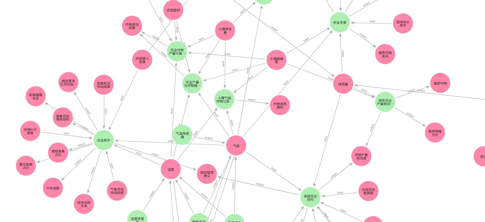

# 🌾 农业知识图谱与智能算法数据库
*A Unified Graph-based Management System for Agricultural Intelligence and Data Resources*

> **天工不遗，以配万物；开悟不止，以成百谷。**

---

## 📘 项目简介

本项目旨在构建一个 **面向农业智能算法的知识图谱与数据管理系统**，实现对农业算法工具与数据资源之间复杂关联关系的统一建模与高效调用。  
系统基于 **Neo4j 图数据库** 实现，以图结构的形式直观呈现农业智能分析中的数据流转、算法依赖和知识关联，为农业数据管理与智能决策提供基础支撑。

---

## 🧩 数据模型设计

系统采用 **双节点 + 双关系** 的图结构建模方式：

| 元素类型 | 含义说明 |
|-----------|-----------|
| **Tool 节点** | 表示农业领域的智能算法，包括预测模型、分析工具及传感器仿真模块等。 |
| **Resource 节点** | 表示各类农业数据资源，从原始传感数据到统计指标与模型输出。 |
| **INPUT 边** (`resource → tool`) | 表示数据资源作为算法输入的依赖关系。 |
| **OUTPUT 边** (`tool → resource`) | 表示算法处理生成的数据输出流向。 |

该设计可形成完整的 **农业数据流图谱（Data Flow Graph）**，支持对数据传输链、算法依赖路径及多源数据融合关系的可视化与分析。

---

## 🌱 子图示例

为便于理解系统结构，本项目提供了一个具有代表性的 **知识子图示例**（见 [neo4j_subgraph.json](neo4j_subgraph.json)）。  
用户可通过导入该文件至 Neo4j 数据库，自行可视化并探索农业知识网络（示例图如下）。

- **规模统计：**
  - 工具节点（Tool）：16 个  
  - 数据节点（Resource）：59 个  
  - INPUT 边：46 条  
  - OUTPUT 边：54 条  
  - 节点平均出/入度：1.24  
  - 最大出度：9；最大入度：7  

</img> 

---

## 🌤 核心数据节点分析

子图以五个关键农业环境指标为锚点，形成数据流转的中心：

| 核心数据节点 | 主要关联功能与算法工具 |
|---------------|-------------------------|
| **气温** | 与作物预测器、农业助手、土壤气候分类器等工具交互，支撑环境监测与生长建模。 |
| **降雨量** | 连接气候指标计算器、作物推荐器、农业顾问系统等，用于灌溉与水资源管理。 |
| **土壤氮含量** | 作为肥力指标，输入作物预测与施肥优化算法。 |
| **土壤磷含量** | 与氮含量协同，为精准施肥与土壤质量评估提供支持。 |
| **湿度** | 连接最多的工具节点，用于病害预测、灌溉控制与生长状态分析。 |

这些核心节点共同构成了农业数据的“中枢神经”，支撑从环境监测、土壤分析到作物管理与水资源优化的智能决策流程。

---

## 🔧 工具节点功能概览

| 工具名称 | 功能说明 |
|-----------|-----------|
| **技术专家作物预测器** | 输入土壤与气象特征，输出作物类别及概率预测。 |
| **农业产量与作物推荐器** | 综合多维环境数据，生成产量与作物推荐结果。 |
| **土壤气候作物分类器** | 根据土壤与气候条件进行分区分类分析。 |
| **气候农业指标计算器** | 计算积温、SPI-like Z分数及水分供需平衡指标。 |
| **高级农业顾问** | 集成市场价格与种植成本，输出收益与产量评估。 |
| **智能农业传感器** | 模拟传感器数据采集，生成露点温度与灌溉建议。 |
| **农业专家系统** | 分析排水与养分条件，输出作物类别评分。 |
| **精准农业作物推荐器** | 结合地理区划与季节信息，生成区域作物推荐。 |
| **农业助手** | 输出病害风险等级与田间管理建议。 |

这些工具节点共同组成了一个协同运作的农业智能生态系统，实现从数据采集到决策生成的全链条闭环。

---

## ⚙️ 技术架构优势

1. **高性能图计算**  
   Neo4j 原生支持多跳查询与路径分析，性能较关系型数据库提升数个数量级。

2. **灵活的模式演化**  
   支持动态扩展新的算法工具与数据类型，无需重构整体架构。

3. **可视化与可追溯性**  
   图结构清晰展现数据流转路径与算法依赖关系，显著降低认知门槛。

---

## 📊 应用前景

该系统为农业数字化与智能化提供了基础设施支撑，可广泛应用于：

- 农业算法合理调度

- 作物生长预测与风险预警

- 智能灌溉与精准施肥决策

- 农业知识图谱构建与因果分析
